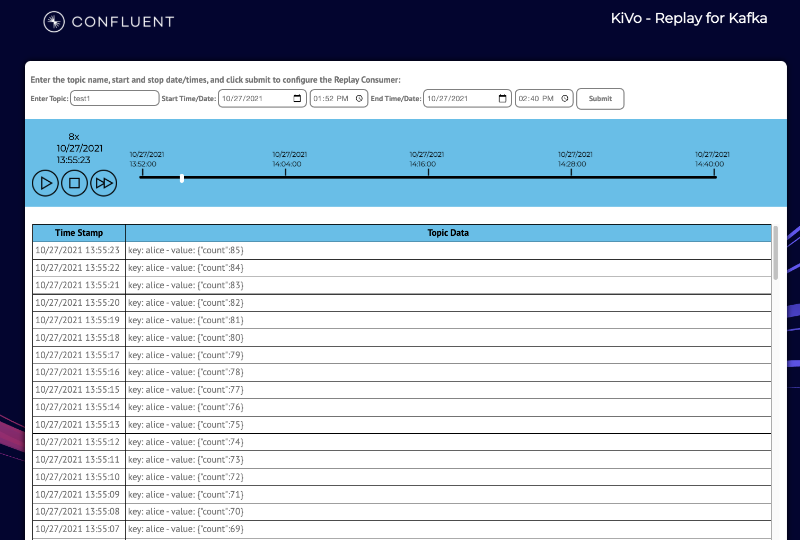

# KiVo - Replay for Kafka
Kivo is a replay capability for Kafka. Users can enter a topic name, start date/time, and end date/time. A Replay 
Consumer is available that wraps the KafkaConsumer and returns data to the application based on the current replay time.

<b>In progress: add an attribute that uses the timestamp in the payload vs. the production time. This is useful to play 
back data that may have been published in batch.</b>




### Application Properties
Update application.properties file based on your environment.
````
# Required connection configs for Kafka producer, consumer, and admin
bootstrap.servers={{ BROKER }}
security.protocol=SASL_SSL
sasl.jaas.config=org.apache.kafka.common.security.plain.PlainLoginModule required username='{{ USERNAME }}' password='{{ PASS }}';
sasl.mechanism=PLAIN
# Required for correctness in Apache Kafka clients prior to 2.6
client.dns.lookup=use_all_dns_ips

# Best practice for Kafka producer to prevent data loss
acks=all
````

